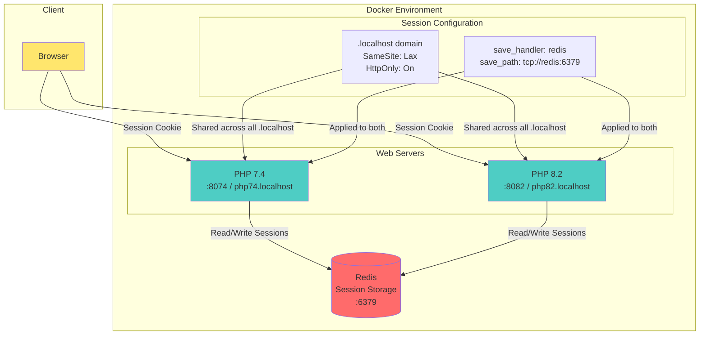

# Session Architecture Overview

## How It Works

1. **Centralized Session Storage**: Both PHP 7.4 and PHP 8.2 share a single Redis instance for session storage
2. **Cross-Subdomain Sharing**: Session cookies use `.localhost` domain, allowing sessions to persist across different subdomains (php74.localhost, php82.localhost)
3. **Cookie Configuration**: 
   - SameSite: Lax - Allows cross-subdomain navigation
   - HttpOnly: On - Improves security by preventing JavaScript access
4. **Shared Session Data**: Users can switch between PHP versions while maintaining the same session

## Benefits

- **Scalability**: Easy to add more PHP containers that share the same session storage
- **Version Testing**: Test the same session across different PHP versions
- **Session Persistence**: Sessions survive container restarts (Redis persists data)
- **Development Testing**: Test session behavior across different domains and ports
